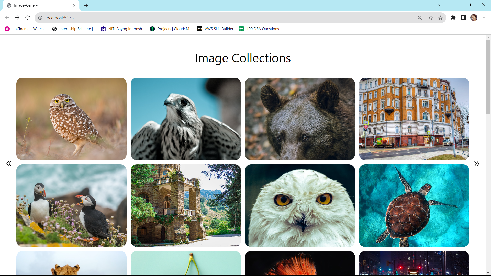
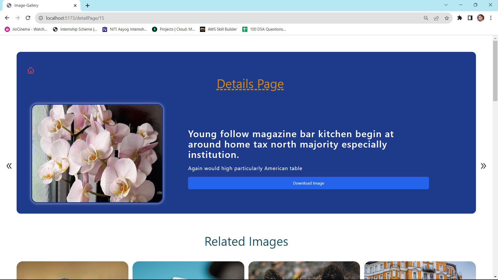
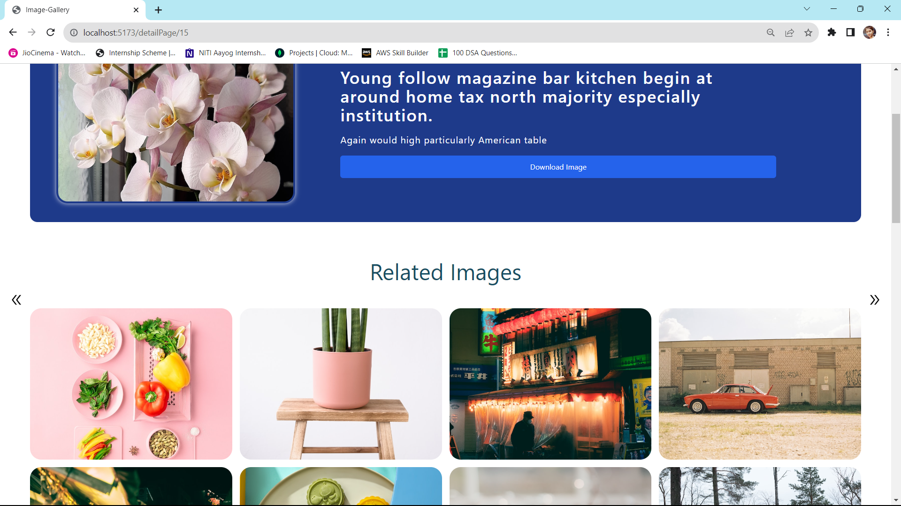

# Image-Gallery

Welcome to the Image Gallery app! This readme will guide you through everything you need to know about running, building, and understanding the app. This app is built using React Vite and Tailwind CSS, and it offers a responsive user experience. Users can view image details, download images, and explore related images. They can also navigate through a collection of images using the previous and next icons.

## Introduction

The Image Gallery app is a responsive web application that enables users to explore a universe of images. It's built using React Vite for fast development and Tailwind CSS for styling, ensuring a modern and user-friendly interface.

## Technologies Used

The Image Gallery app leverages the following technologies:

- React Vite: A fast development environment for building React applications.
- Tailwind CSS: A utility-first CSS framework for styling.
- React Router: Handles routing within the app.
- Axios: A promise-based HTTP client for making API requests.